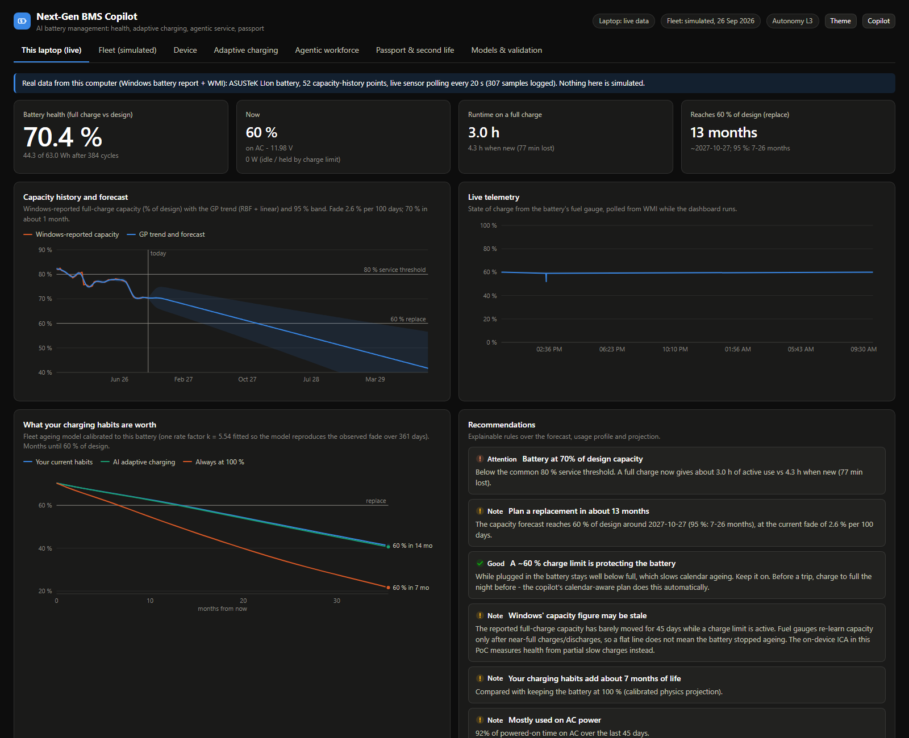
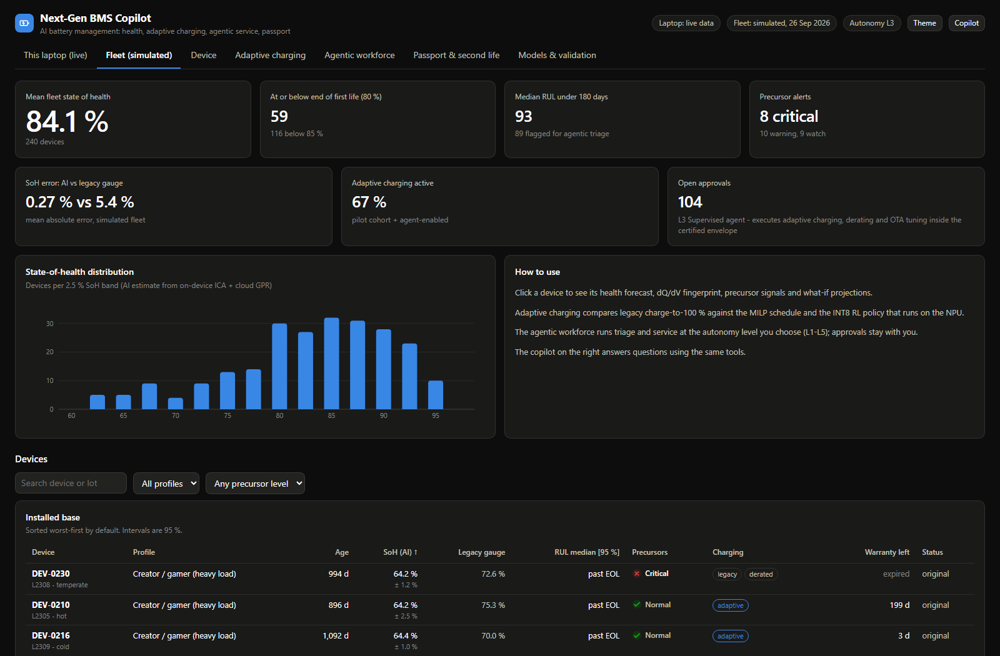
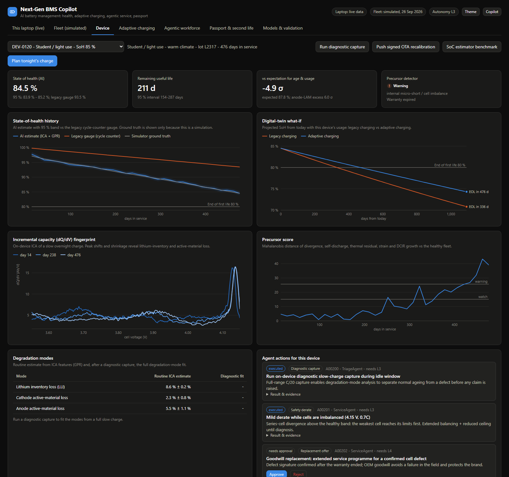
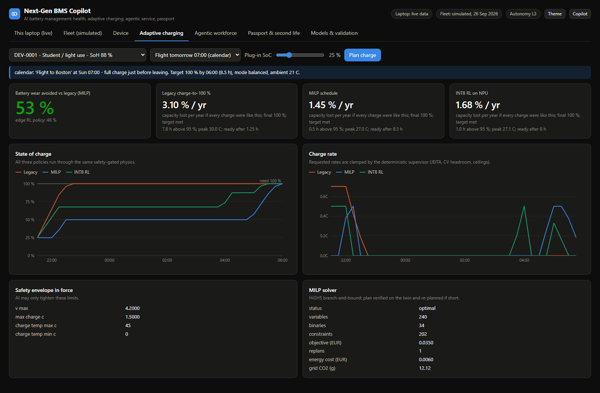
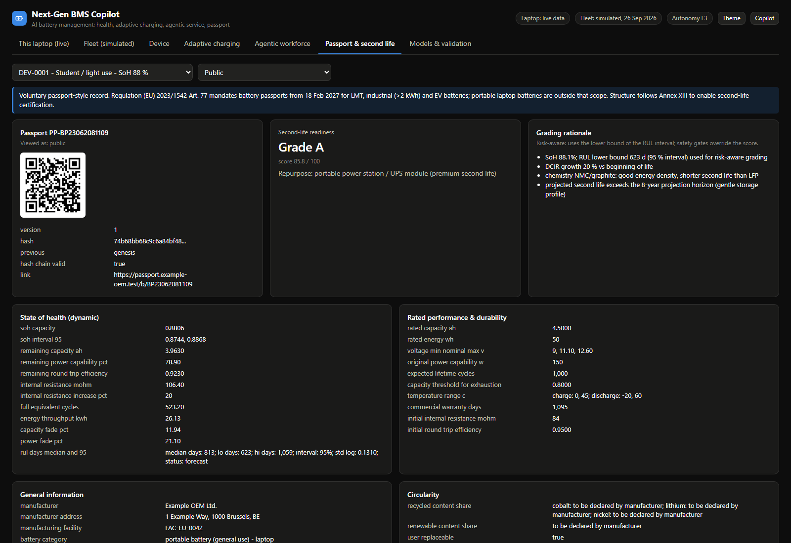
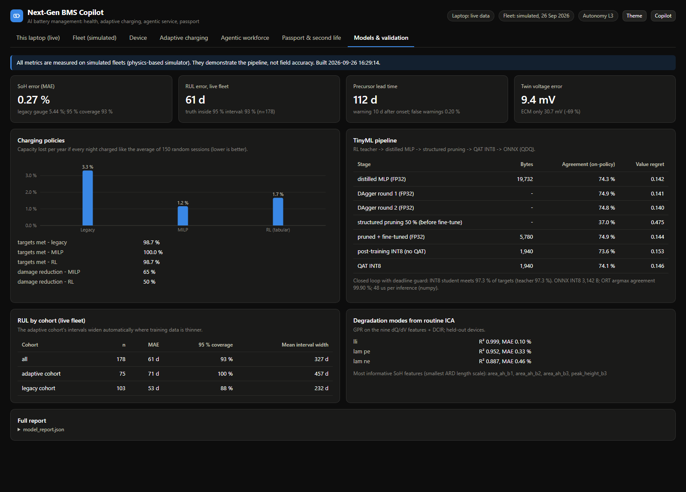
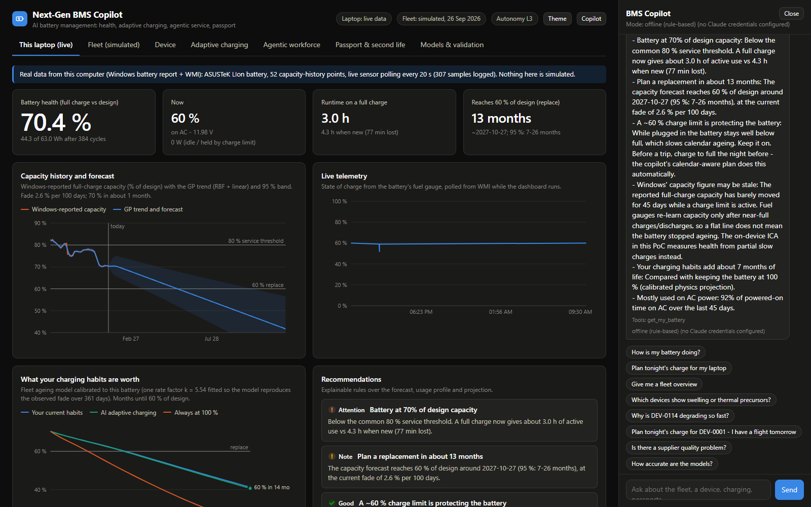
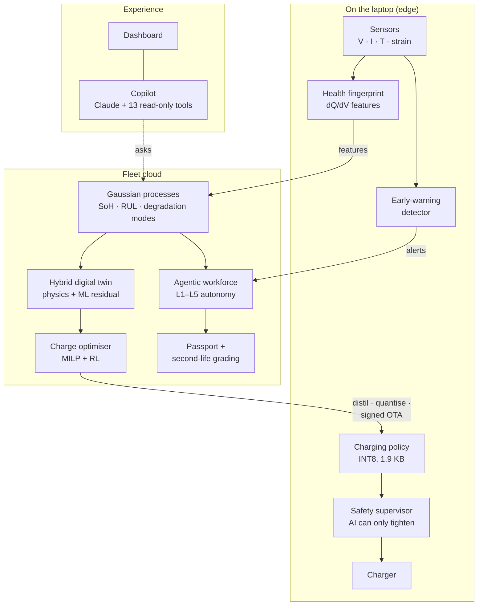

# Battery Management AI

**An AI copilot for laptop batteries. It works out how healthy a battery really is, predicts when it will need replacing, charges it in the way that wears it least, spots dangerous faults weeks early, and explains all of it in plain language.**

[](https://github.com/medhu0505/Battery-Management-AI/actions/workflows/ci.yml)




<sub>The dashboard (branded *Next-Gen BMS Copilot* in the app) running on my own laptop. It read 52 capacity measurements from Windows, forecast when the battery reaches 60 % (with a confidence band) and planned tonight's charge.</sub>

---

## In one minute

Most laptops know very little about their own battery. The "battery health" figure is often inferred from cycle counts and occasional full charges, so it can drift by several percentage points. Charging is "fill to 100 % as fast as possible and keep it there", which is the habit that ages lithium-ion cells fastest. Faults such as a swelling cell are noticed only after the hardware trips or the case bulges.

This project is a working prototype of what an AI battery management system could do instead:

| Question a user or service team asks | What the system does | Result |
|---|---|---|
| *"How healthy is my battery, really?"* | Reads the electrochemical "fingerprint" of each charge (incremental capacity analysis) and feeds it to a Gaussian-process model that also reports its own uncertainty | **0.27 %** average error, vs **5.4 %** for a cycle-counting gauge |
| *"When will I need a new one?"* | Forecasts remaining useful life with a 95 % confidence interval | Off by **45 days** on average; the true date falls inside the interval **91 %** of the time |
| *"Can charging be gentler?"* | Plans each night's charge with an optimiser (mixed-integer linear programming) and a reinforcement-learning policy, both bound by a safety supervisor | **65 % less** capacity loss than charge-to-100 %, with every morning's target met |
| *"Is anything about to go wrong?"* | A statistical early-warning detector (Mahalanobis distance and CUSUM) watches strain, temperature and self-discharge | Swelling and micro-shorts flagged **10 days** after onset, **~4 months** before they turn critical; 0.2 % false alarms |
| *"What should we do about it?"* | Six AI agents triage, file claims, order parts and track the supply chain. Five autonomy levels decide what needs human approval. | A defective supplier batch was detected from fleet telemetry alone (p ≈ 6 × 10⁻⁴) |
| *"Explain it to me."* | A conversational copilot (Claude, with 13 analysis tools) answers questions about any device or the whole fleet | Works offline too, with a rule-based fallback |

It runs in two modes: on **the real battery of the computer it is installed on** (Windows), and on a **physics-based simulation of 440 laptops**. The simulation supplies what one laptop can't, namely years of ageing data, injected defects and known ground truth to score the models against.

> **Honesty note.** Fleet metrics are measured on a simulator, so they show the pipeline works. They are not field accuracy. The real-laptop numbers are real, but they come from one battery. See [Limitations](#limitations).

---

## Contents

- [Motivation](#motivation)
- [Objectives](#objectives)
- [Results](#results)
- [Screenshots](#screenshots)
- [How it works](#how-it-works)
- [Features](#features)
- [Tech stack](#tech-stack)
- [Getting started](#getting-started)
- [Usage examples](#usage-examples)
- [Project structure](#project-structure)
- [Testing and CI](#testing-and-ci)
- [Methodology](#methodology)
- [Lessons learned](#lessons-learned)
- [Limitations](#limitations)
- [Roadmap](#roadmap)
- [References](#references)
- [License](#license)

---

## Motivation

Batteries are the part of a laptop that wears out first, and the part users notice most when it does. Three gaps stood out:

1. **Health estimates are crude.** Fuel gauges infer capacity from cycle counts and occasional full charges. My own laptop's reported capacity stayed flat for 45 days while a charge limit was active. The battery had not stopped ageing; the gauge had simply stopped re-learning.
2. **Charging ignores how cells age.** Lithium-ion cells age fastest when held at a high state of charge, especially when warm. A charger that knows when you will unplug, and how much you will use, can stay low overnight and finish just in time.
3. **Service is reactive.** Faults surface as returns and warranty claims long after the evidence was in the telemetry. Spotting a bad supplier batch early is worth far more than replacing its cells one by one.

I wanted to see how far a single, well-engineered codebase could close these gaps end to end: physics, machine learning, optimisation, embedded deployment, safety, regulation and a usable interface. Each piece is validated against ground truth rather than demoed in isolation.

## Objectives

| # | Objective | Status |
|---|---|---|
| 1 | Estimate state of health from routine charging data more accurately than a cycle-counting gauge, with calibrated uncertainty | Met: 0.27 % vs 5.4 % MAE, 93 % interval coverage |
| 2 | Predict remaining useful life with a trustworthy confidence interval | Met: 91 % coverage of the 95 % interval (held-out devices) |
| 3 | Cut charging-induced ageing without ever missing the user's morning target | Met: -65 % ageing, 100 % of targets met (MILP) |
| 4 | Show that the charging policy can run on a microcontroller | Met: a 1.9 KB INT8 network, about 50 µs per decision, same closed-loop result as the full model |
| 5 | Warn about safety-relevant faults early, with almost no false alarms | Met: 10 days after onset, 0.2 % false warnings, mechanism correct 15 of 15 |
| 6 | Guarantee that AI can never loosen a safety limit | Met by construction, and fuzz-tested |
| 7 | Turn insights into actions with human oversight that can be audited | Met: 6 agents, 5 autonomy levels, consent gating, audit trail |
| 8 | Run on a real battery, not only on simulated ones | Met: Windows battery report and live WMI readings, forecast, usage learning, nightly plan |

---

## Results

### On a real laptop (my own, snapshot 3 Oct 2026)

| What | Result |
|---|---|
| Health | 44.3 of 63.0 Wh design capacity (**70.4 %**) after 384 cycles. A full charge now gives about 3.0 h of use, vs 4.3 h when new. |
| History | 52 capacity measurements from Windows, from 82.3 % (Oct 2025, cycle 219) to 70.4 % today. One corrupt Windows entry, logging 592,623 hours of standby in a single day, was detected and excluded. |
| Forecast | Fading **2.6 % per 100 days**. Expected to reach 60 % of design around **Oct 2027** (95 % interval: 7–26 months). |
| Learned behaviour | On AC power 92 % of the time; uses about 18 Wh/day from the battery (41 % of a charge); a **60 % firmware charge limit was detected automatically**. |
| What-if | With the ageing model calibrated to this battery, current habits reach 60 % in about 14 months. Keeping the battery at 100 % would get there in about 7. |
| Tonight's plan | No charging needed, because 60 % covers a typical day: **83 % less wear** than charging to 100 %. If a trip is in the calendar, it fills to 100 % just before departure. |
| Insight | Windows' capacity figure has been flat for 45 days under the charge limit. That points to a stale fuel gauge, not a battery that stopped ageing, and it is exactly the case for on-device health sensing. |

### On the simulated fleet (200 retired devices to train on, 240 in service)

| Capability | AI result | Baseline |
|---|---|---|
| State of health (mean abs. error, held-out devices) | **0.27 %**, 93 % of true values inside the 95 % interval | Cycle-counting gauge: 5.4 % |
| Remaining useful life | MAE **45 days** (28 days in the final year), 91 % coverage | n/a |
| Remaining life, in-service fleet (future hidden) | MAE 61 days, 93 % coverage | n/a |
| Degradation-mode estimates (R²) | Lithium inventory 0.999 · cathode 0.95 · anode 0.89 | n/a |
| Fault early warning (swelling, micro-short) | **10 days** after onset, **112 days** before critical, mechanism correct 15/15, 0.2 % false warnings | Hardware trip after the event |
| Digital-twin voltage error | **9.4 mV** RMSE (physics + learned residual) | Physics only: 30.7 mV |
| State of charge on an aged cell | **1.4 %** error (recalibrated Kalman filter) | Coulomb counting: 6.3 % |
| Charging wear (capacity lost per year if every night charged this way) | MILP **1.16 %/yr (-65 %)**, RL 1.66 %/yr (-50 %); targets met 100 % / 98.7 % | Charge-to-100 %: 3.31 %/yr |
| On-device policy (INT8, 1.9 KB) | 97.3 % of targets met with the deadline guard, the same as the full RL policy; ONNX INT8 matches 99.9 % of decisions | FP32 distilled: 19.7 KB |
| Fleet ageing, adaptive vs legacy charging | Adaptive cohort fades **22 % slower** (1.75 vs 2.25 % per 100 days, matched by usage profile) | n/a |
| Agent triage (L5 run) | 4/4 swelling and 1/1 micro-short escalated as safety; 8/9 anode defects identified (2 false calls, each with evidence for review); **bad supplier lot found** (p ≈ 6 × 10⁻⁴) | Break-fix returns |

The full tables live in [docs/results.md](docs/results.md) and in the *Models & validation* tab.

---

## Screenshots

| | |
|---|---|
|  **Fleet.** KPIs, health distribution and the installed base. |  **Device.** AI vs legacy gauge vs truth, what-if, dQ/dV fingerprint, early-warning score. |
|  **Adaptive charging.** Legacy vs optimiser vs on-device RL, on the same safety-gated physics. |  **Agentic workforce.** Autonomy levels, approval queue, design-feedback insights. |
|  **Battery passport.** Access tiers, hash-chained record, QR code, second-life grade. |  **Models & validation.** Every metric, regenerated on each training run. |
|  **Copilot.** Natural-language questions answered by calling analysis tools. |  **This laptop.** The real battery: health, forecast, habits, tonight's plan. |

---

## How it works



**In plain terms:**

1. **Sense.** As the battery charges, the system measures how much charge goes in at each voltage. That curve (dQ/dV) has peaks that shift and shrink in recognisable ways as a cell ages. It is a fingerprint read from data the laptop already collects.
2. **Understand.** Gaussian-process models turn the fingerprint into a health estimate with an honest error bar. They also split ageing into three physical causes: lost lithium, damaged cathode and damaged anode. Telling a manufacturing defect apart from normal wear depends on that split.
3. **Predict.** A digital twin (physics model plus a learned correction) projects the battery forward, giving remaining life and "what if you charged differently?" scenarios.
4. **Act gently.** Each evening an optimiser plans the charge: stay low, finish just before you unplug, avoid heat. The plan is checked on the twin and re-planned if it falls short. The policy is compressed to fit on a microcontroller.
5. **Stay safe.** A deterministic supervisor sits between every AI decision and the charger. AI can only make limits *stricter*; anything looser is rejected.
6. **Respond.** Agents turn findings into service actions such as diagnostics, warranty claims, replacement offers and supplier-quality alerts. The chosen autonomy level decides what needs a human.
7. **Explain.** A copilot answers questions by calling the same analysis functions, so its answers are grounded in the models rather than invented.

More detail: [docs/architecture.md](docs/architecture.md).

---

## Features

**Health and prediction**
- Electrode-level open-circuit-voltage model (graphite / NMC811) with three degradation modes: loss of lithium inventory, loss of cathode material and loss of anode material.
- On-device incremental capacity analysis: voltage-histogram dQ/dV, Savitzky–Golay smoothing, nine peak and area features.
- Exact Gaussian-process regression with per-feature length scales and analytic gradients. Predicts SoH, degradation modes and RUL, each with an uncertainty.
- Hybrid digital twin: an equivalent-circuit model plus a learned ridge-regression residual (69 % lower voltage error).
- Extended Kalman filter for state of charge, recalibrated from the twin as the cell ages.

**Charging**
- Mixed-integer linear program (SciPy / HiGHS). Costs come from the ageing physics, plus thermal and constant-voltage constraints and a plan → verify → re-plan loop.
- Tabular Q-learning, vectorised in NumPy: about 900,000 training episodes per build.
- Context model: learned unplug time and daily energy need, plus calendar overrides (flight, trip, light day).
- TinyML pipeline: distillation → DAgger → structured pruning → quantisation-aware INT8 → ONNX, checked with onnxruntime, plus a deterministic deadline guard.

**Safety and service**
- Early-warning detector: detrended Mahalanobis score, CUSUM and hard rules, with mechanism attribution (swelling vs micro-short vs imbalance).
- Safety supervisor with JEITA temperature derating and fixed hardware ceilings. AI requests can only tighten limits (fuzz-tested).
- Six agents (Predictive → Triage → Service → Logistics → Asset Recovery → Design Feedback) with autonomy levels L1–L5, consent gating, de-duplication and an audit trail.
- Ed25519-signed over-the-air updates with device binding, expiry and anti-rollback.
- Battery-passport record following EU Regulation 2023/1542 Annex XIII: role-based access, hash-chained versions and a QR code. Second-life grading A/B/C/F.

**Real hardware and interface**
- Live Windows battery: `powercfg /batteryreport` history and WMI readings, with sanity checks for corrupt entries.
- Capacity-fade forecast with a sampled 95 % interval; usage profiling with charge-limit detection; ageing model calibrated to the actual battery.
- Dependency-free web dashboard with hand-rolled SVG charts, dark mode and shareable deep links.
- Claude copilot with 13 read-only tools; deterministic offline fallback when no API key is set.

---

## Tech stack

| Area | Tools |
|---|---|
| Language | Python 3.12+, JavaScript (no framework) |
| Numerics and ML | NumPy, SciPy (optimisation, signal processing, statistics); Gaussian processes, Q-learning, the MLP and the quantisation are implemented from scratch |
| Optimisation | SciPy `milp` (HiGHS solver) |
| Edge deployment | ONNX, onnxruntime (INT8 QDQ) |
| API | FastAPI, Uvicorn, Pydantic |
| Security | `cryptography` (Ed25519 signatures), SHA-256 hash chains |
| LLM | Anthropic Python SDK (Claude), manual tool-use loop |
| Hardware access | Windows `powercfg`, WMI (`root\wmi`) via PowerShell |
| Quality | pytest, Ruff, GitHub Actions (Ubuntu and Windows, Python 3.12 and 3.13) |

There is deliberately no PyTorch, scikit-learn or charting library. Writing the GP, the RL and the quantisation by hand kept the dependency footprint small and the maths inspectable.

---

## Getting started

### Requirements

- Python **3.12 or newer**
- About 500 MB of free disk space (dependencies and trained artifacts)
- **Windows** for the live "This laptop" tab. Everything else, including the simulated fleet, runs on Windows, macOS and Linux.

### Quick start (Windows)

Clone the repo and double-click **`run.bat`**. On the first run it:

1. creates a virtual environment in `.venv`,
2. installs the dependencies,
3. trains every model (about 3 minutes; writes `artifacts/`),
4. starts the server and opens http://127.0.0.1:8000.

Later runs start in seconds. To use another port, run `run.bat 8010`.

### Manual setup (any OS)

```bash
git clone https://github.com/medhu0505/Battery-Management-AI.git
```
```bash
cd Battery-Management-AI
```
```bash
python -m venv .venv
```

Activate the environment. On Windows use `.venv\Scripts\activate`; on macOS and Linux use `source .venv/bin/activate`. Then:

```bash
pip install -r requirements.txt
```
```bash
python -m bms_copilot.train
```
```bash
python -m bms_copilot.api
```

Open http://127.0.0.1:8000.

`python -m bms_copilot.train --quick` builds a smaller model set in a minute or two, which is handy for a first look. The full build is the one the published metrics come from.

### Optional: the Claude copilot

Without credentials the copilot answers through a deterministic offline responder, and the dashboard shows which mode is active. To use Claude, set an API key before starting the server:

```bash
export ANTHROPIC_API_KEY=your-key-here
```

On Windows PowerShell use `$env:ANTHROPIC_API_KEY = "your-key-here"` instead.

| Variable | Purpose | Default |
|---|---|---|
| `BMS_COPILOT_MODEL` | Claude model for the copilot | `claude-opus-5` |
| `BMS_COPILOT_EFFORT` | Reasoning effort (`low` … `max`) | `medium` |
| `BMS_COPILOT_LLM` | Set to `off` to force offline mode | on |
| `BMS_BATTERY_REPORT` | Analyse a saved battery report instead of this machine | unset |
| `BMS_ARTIFACTS` | Use a different artifact directory | `./artifacts` |

### Optional: analyse another laptop's battery

On any Windows laptop, generate a report:

```bash
powercfg /batteryreport /xml /output report.xml
```

Copy `report.xml` over, set `BMS_BATTERY_REPORT=path/to/report.xml`, and start the server. This also works on macOS and Linux. Only the battery sections are parsed; computer name and BIOS details are ignored.

---

## Usage examples

### Dashboard

| Tab | What to try |
|---|---|
| **This laptop** | Your real battery: health, the capacity forecast, the calibrated what-if, the learned usage profile and tonight's plan. Press *Plan with a trip tomorrow* to see the plan change. |
| **Fleet** | Sort the installed base by health or risk; click any device to open it. |
| **Device** | Run a diagnostic capture, push a signed OTA update (and watch tampered, replayed and wrong-device packages get rejected), or benchmark SoC estimators. |
| **Adaptive charging** | Pick a scenario (routine, flight, hot room …) and compare legacy, optimiser and on-device RL charging. |
| **Agentic workforce** | Choose an autonomy level, press *Run agents*, then approve or reject the queued actions. |
| **Passport** | Switch the viewer role (public, legitimate interest, authority) to see different access tiers. |

Every view has a shareable deep link:

```text
http://127.0.0.1:8000/#tab=device&id=DEV-0120
http://127.0.0.1:8000/#tab=charging&id=DEV-0001&scenario=flight
http://127.0.0.1:8000/#tab=fleet&ask=Which%20devices%20need%20attention%3F
```

### REST API

Interactive docs are served at http://127.0.0.1:8000/docs. A few examples (the simulated fleet's clock is 26 Sep 2026, so the flight below is "tomorrow morning"):

```bash
curl http://127.0.0.1:8000/api/fleet/insights
```
```bash
curl http://127.0.0.1:8000/api/devices/DEV-0120
```
```bash
curl -X POST http://127.0.0.1:8000/api/devices/DEV-0120/charge-plan -H "Content-Type: application/json" -d "{\"calendar_events\": [{\"title\": \"Flight\", \"start\": \"2026-09-27T07:00:00\", \"kind\": \"flight\"}]}"
```
```bash
curl http://127.0.0.1:8000/api/mybattery
```
```bash
curl -X POST http://127.0.0.1:8000/api/copilot -H "Content-Type: application/json" -d "{\"message\": \"Which devices need attention this week, and why?\"}"
```

| Endpoint | Description |
|---|---|
| `GET /api/fleet`, `/api/fleet/insights` | Fleet KPIs, supplier-lot statistics, ageing drivers |
| `GET /api/devices/{id}` | Health, RUL, degradation modes, anomaly score, history |
| `POST /api/devices/{id}/diagnose` | Run a diagnostic capture and degradation-mode fit |
| `POST /api/devices/{id}/charge-plan` | Optimised charge plan vs legacy vs RL |
| `GET /api/devices/{id}/passport?role=public` | Battery passport for an access tier |
| `GET /api/devices/{id}/second-life` | Second-life grade and rationale |
| `POST /api/devices/{id}/ota` | Build, sign and verify an OTA package |
| `GET /api/workforce`, `POST /api/workforce/run` | Agent actions; run the agents |
| `PUT /api/workforce/level` | Set autonomy level 1–5 |
| `GET /api/mybattery`, `POST /api/mybattery/charge-plan` | The real battery of this computer |
| `POST /api/copilot` | Chat with the copilot |
| `GET /api/models` | Every validation metric |

### Training options

```bash
python -m bms_copilot.train --history 200 --live 240 --rl-batches 220
```

`--history` and `--live` set the number of retired and in-service devices to simulate, `--quick` makes a small fast build, and `--out` writes to another directory.

---

## Project structure

```text
Battery-Management-AI/
├── bms_copilot/
│   ├── config.py          Cell and pack specification, safety envelope, service policy
│   ├── physics/           Electrode OCV and degradation modes, ECM + thermal model, ageing laws
│   ├── sim/               Usage profiles, sensor/AFE model, fleet simulator, diagnostic captures
│   ├── edge/              ICA features, SoC EKF, early-warning detector, TinyML pipeline
│   ├── safety/            Deterministic safety supervisor
│   ├── charging/          Session physics, context model, MILP optimiser, Q-learning
│   ├── cloud/             Gaussian processes, health models, digital twin, OTA, passport, grading
│   ├── agents/            Agentic workforce (six agents, L1–L5 autonomy)
│   ├── copilot/           Claude tool-use loop, tool definitions, offline responder
│   ├── live/              Real Windows battery: report + WMI reader, analysis, background poller
│   ├── api/               FastAPI server
│   ├── web/               Dashboard (HTML, CSS, vanilla JS, SVG charts)
│   ├── engine.py          Runtime facade shared by the API, agents and copilot
│   └── train.py           Simulates the fleet, trains and validates every model
├── tests/                 40 unit tests + 5 end-to-end API tests
├── docs/                  Architecture, methodology, results, lessons learned, screenshots
├── .github/workflows/     CI: lint + tests on Ubuntu and Windows
├── run.bat                One-click setup and launch (Windows)
├── pyproject.toml         Package metadata, pytest and Ruff config
└── requirements*.txt      Runtime and development dependencies
```

`artifacts/` (trained models, signing keys, battery logs) is generated locally by `train.py` and is not committed.

---

## Testing and CI

```bash
python -m pytest -m "not slow"
```
```bash
python -m pytest -m slow
```
```bash
ruff check bms_copilot tests
```

- **Unit tests (40, a few seconds)** cover:
  - the physics invariants (OCV monotonic, every degradation mode reduces capacity);
  - ICA features, GP gradients and interval calibration, and degradation-mode recovery;
  - the safety supervisor never exceeding its envelope (fuzzed), AI only tightening, and hardware trips firing on their own;
  - the charge optimiser beating legacy charging across scenarios while respecting a tightened envelope;
  - OTA signature, device binding, anti-rollback and expiry;
  - passport access tiers and the hash chain;
  - agent autonomy gating, promotion and human approval;
  - second-life grading safety gates;
  - the copilot tool loop and its offline fallback;
  - Windows battery-report parsing, forecasting, usage profiling and planning (on a synthetic fixture).
- **End-to-end tests (5, about 2 minutes)** train a small model set from scratch and drive every API route.
- **GitHub Actions** runs lint and unit tests on Ubuntu and Windows with Python 3.12 and 3.13, plus the end-to-end suite on Ubuntu.

On Windows, pytest may print `Windows fatal exception: access violation` with a stack trace during the MILP solves. HiGHS's thread pool raises and handles a native exception internally, and pytest's fault handler reports it anyway. The results are correct and the tests pass.

---

## Methodology

The approach follows one principle: **every model is scored against ground truth it did not see.**

1. **Simulate with physics, not noise.** An electrode-level model generates open-circuit voltages, and a second-order equivalent circuit with a thermal model generates the dynamics. Semi-empirical laws (calendar SEI growth, cycling, lithium plating, active-material loss) drive the ageing. The fleet has 5 usage profiles, several climates, sensor gain errors, cell-to-cell spread, and injected defects: a bad supplier lot, swelling cells and micro-shorts.
2. **Split by device, not by sample.** 200 "retired" devices with full histories train the models. 240 in-service devices are scored with their futures hidden.
3. **Compare against what exists today.** Every AI result has a baseline next to it: the cycle-counting gauge, coulomb counting, or legacy charge-to-100 %.
4. **Close the loop.** Charging policies are scored by simulating whole nights on the safety-gated physics, not by imitation accuracy.
5. **Then test on real hardware.** The same forecasting and planning code runs on a real laptop battery, read from Windows.

Details, equations and design choices: [docs/methodology.md](docs/methodology.md).

---

## Lessons learned

A few of the things that surprised me (full write-up in [docs/lessons-learned.md](docs/lessons-learned.md)):

- **Imitation accuracy isn't closed-loop performance.** The first compressed charging policy agreed with its teacher on 74 % of decisions but met only 62 % of morning targets, because small errors compound over a night. Two changes closed the gap: DAgger (training on the states the student actually visits) and a tiny deterministic deadline guard.
- **Plans need checking against reality.** A linear optimiser underestimates the slow constant-voltage tail at high charge. The fix was *plan → verify on the twin → re-plan or top up*.
- **False alarms come from trends, not noise.** The early-warning detector's false-alarm rate fell from 21 % to 0.2 % once slow ageing trends were removed before computing anomaly scores.
- **Real data is messy in ways simulations aren't.** Windows logged a day with 592,623 hours of standby. The fuel gauge went stale under a charge limit. Both needed explicit handling before any model ran.
- **Simulations that are too clean flatter the model.** Adding a realistic current-sensor gain error (σ = 0.6 % per device) moved SoH error from 0.10 % to 0.27 %, which is less impressive and more honest.
- **Safety by construction beats safety by testing.** Because the supervisor sits between AI and hardware and only accepts stricter limits, no model bug can loosen them.
- **Read the regulation, not the summary.** The EU battery passport is mandatory for EV, industrial and light-means-of-transport batteries, not laptop batteries. The passport here is a voluntary record, and says so.

---

## Limitations

- **Simulated fleet.** The fleet metrics come from a physics simulator. The degradation-mode fit uses the same electrode model that generated the data, so its accuracy is a best case. Real cells would need calibration against lab tests.
- **One real battery.** The real-hardware results come from a single laptop. They show that the pipeline works on real data, not how accurate it is across a population.
- **Observe, don't actuate.** On a real laptop the charging plan is advisory. Charge current is set by the manufacturer's embedded-controller firmware, so applying a plan would need firmware integration.
- **Mock back-ends.** Warranty claims, orders, shipments and notifications are recorded, not sent anywhere.
- **Not safety-certified.** The safety layer shows the architecture (AI can only tighten). It is not ISO 26262 or IEC 62133 certified firmware.
- **Development keys.** Signing keys are generated locally. Production would use an HSM or a managed key vault.
- **Windows only for live data.** macOS and Linux battery readers are not implemented yet; a saved Windows report can be analysed on any OS.

---

## Roadmap

- **Validate on lab data.** Fit the electrode model and GPs to public ageing datasets (e.g. the Oxford, NASA or Severson/MIT cycling sets) and report accuracy on real cells.
- **Cross-platform live readers.** macOS (`ioreg` / `system_profiler`) and Linux (`/sys/class/power_supply`).
- **Federated learning.** Train the health models across devices without centralising raw telemetry.
- **Firmware actuation.** Integrate with an embedded-controller interface to apply charge limits and current profiles on supported laptops.
- **Model-based RL.** Replace tabular Q-learning with a policy trained against the digital twin across a wider state space.
- **Docker image and hosted demo.** One-command deployment with a pre-built artifact set.

---

## References

- C.-H. Chen *et al.*, "Development of Experimental Techniques for Parameterization of Multi-scale Lithium-ion Battery Models", *J. Electrochem. Soc.* 167, 080534 (2020). Graphite and NMC811 open-circuit potentials.
- C. R. Birkl *et al.*, "Degradation diagnostics for lithium ion cells", *J. Power Sources* 341 (2017). LLI / LAM degradation modes.
- M. Dubarry, C. Truchot, B. Y. Liaw, "Synthesize battery degradation modes via a diagnostic and prognostic model", *J. Power Sources* 219 (2012).
- C. E. Rasmussen, C. K. I. Williams, *Gaussian Processes for Machine Learning*, MIT Press (2006).
- S. Ross, G. Gordon, D. Bagnell, "A Reduction of Imitation Learning and Structured Prediction to No-Regret Online Learning" (DAgger), AISTATS (2011).
- Regulation (EU) 2023/1542 concerning batteries and waste batteries, Art. 77 and Annex XIII (battery passport).
- JEITA, "A Guide to the Safe Use of Secondary Lithium Ion Batteries in Notebook-type Personal Computers" (temperature-dependent charging).

---

## License

[MIT](LICENSE) © 2026 Medhansh Sharma

Built as a portfolio project. Feedback and issues are welcome.
