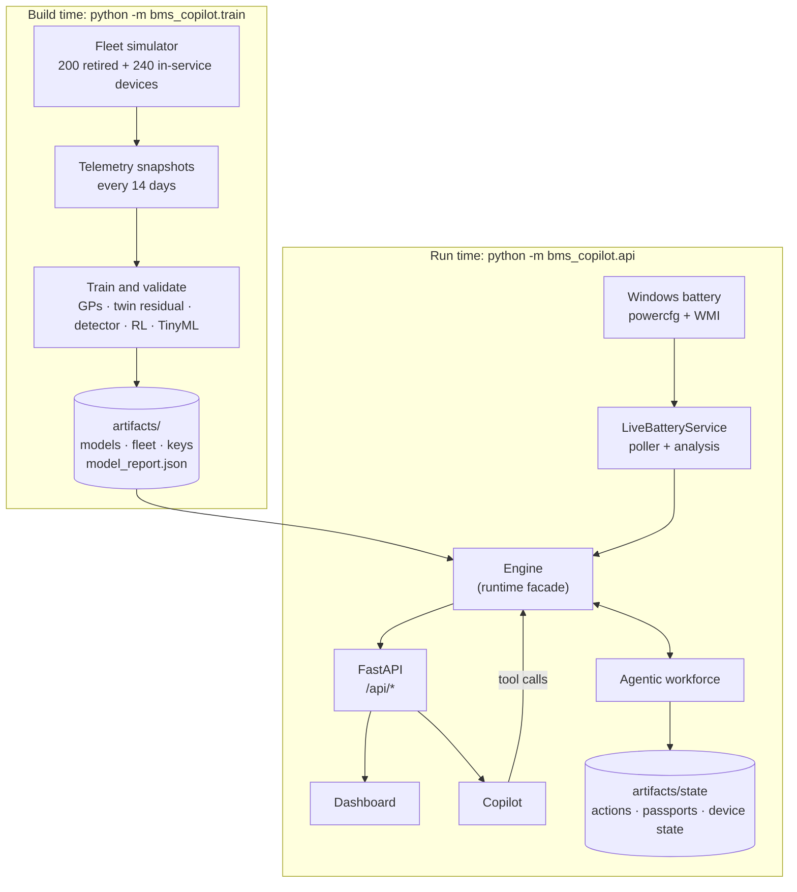
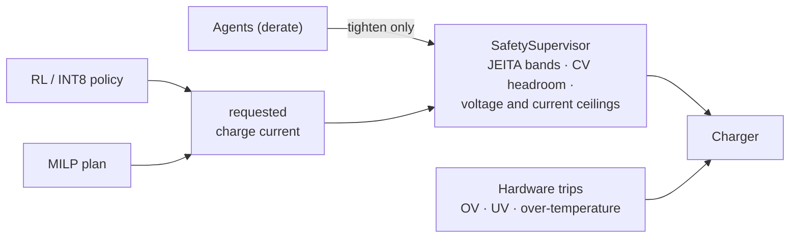
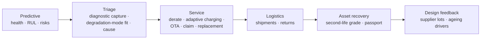

# Architecture

This page explains how the system is put together: the layers, how data moves between them, and where the safety boundary sits. For *why* each model was chosen, see [methodology.md](methodology.md).

## Layers

The design follows the layers of a real laptop battery stack, from the cells up to the cloud.

| Layer | Responsibility | Code |
|---|---|---|
| **L1 Cells and sensing** | Measure voltage, current and temperature (plus an optional strain sensor) the way a battery front-end chip would: noisy, quantised, with gain error | `sim/sensors.py`, `sim/fleet.py` |
| **L2 Embedded safety** | Deterministic limits that no AI component can loosen | `safety/envelope.py` |
| **L3 Edge AI** | Health fingerprinting (dQ/dV), state-of-charge estimation, early-warning detection and the compact charging policy, all small enough for a microcontroller or NPU | `edge/` |
| **L4 Platform** | Signed over-the-air updates that carry calibrations and models to the device | `cloud/ota.py` |
| **L5 Fleet cloud** | Gaussian-process health models, the hybrid digital twin, the charge optimiser, agents, the passport and grading | `cloud/`, `charging/`, `agents/` |
| **Experience** | REST API, dashboard and conversational copilot | `api/`, `web/`, `copilot/` |

Underneath all of these is a **physics layer** (`physics/`) that serves two roles. It is the "truth" that generates simulated telemetry, and it is the model that the optimiser and twin reason with.

## Data flow

- **`train.py`** runs once. It simulates both fleet cohorts, trains every model, scores each against held-out ground truth and writes everything to `artifacts/`. The metrics shown in the dashboard come from the `model_report.json` it produces.
- **`engine.py`** is the single runtime facade. The API, the agents and the copilot all call the same `Engine` methods, so a number in the dashboard, an agent's evidence and a copilot answer cannot disagree.
- **`live/`** is independent of the simulation. While the server runs, a background thread reads WMI every 20 seconds and logs the samples to `artifacts/live/`; the experimental on-device dQ/dV is built from these. The Windows battery report is regenerated on demand once it is more than 30 minutes old.

## The safety boundary

Every charge command from any AI component goes through `SafetySupervisor.gate_charge`, which clamps it to the certified envelope. Agents may ask for a *stricter* limit, such as a lower voltage ceiling for a cell showing swelling precursors. A request that would loosen anything is rejected and logged. Hardware trips are evaluated independently of any AI state.

This is enforced in code, not by convention. `tests/test_core.py` fuzzes the supervisor with random requests and asserts that the output never exceeds the envelope, and that loosening requests are always refused.

## Agent autonomy ladder

| Level | Name | What executes automatically |
|---|---|---|
| L1 | Tool | Nothing; every action is logged as a recommendation |
| L2 | Assistant | Nothing; engineers approve policy and safety changes |
| L3 | Supervised agent | Adaptive charging, safety derates, OTA recalibration (all inside the certified envelope) |
| L4 | Autonomous agent | The above, plus warranty claims; the user still confirms replacements |
| L5 | Agentic workforce | The above, plus replacement orders before failure, **only with pre-approved user consent** |

Each action type has a required level. If the current level is high enough, the action executes. One level short, it waits for human approval. Further short, it is logged as a recommendation. Raising the level promotes waiting actions instead of creating duplicates. Every action keeps an audit history.

The six agents run in sequence on each pass:

## Copilot

The copilot is a manual tool-use loop on the Anthropic Messages API:

1. The user's question and the conversation so far go to Claude together with 13 tool definitions (fleet overview, device health, diagnose, plan charging, what-if, passport, second-life grade, agent actions, fleet insights, my battery, plan my charge, model performance, list devices).
2. Claude calls tools; the server runs them against the `Engine` and returns JSON results.
3. The loop repeats until Claude produces a final answer.

All tools are **read or analyse only**. Approving actions, changing autonomy, pushing OTA packages and editing safety limits are deliberately left out, so those stay with a human in the dashboard.

Without API credentials, or with `BMS_COPILOT_LLM=off`, a deterministic rule-based responder answers the same question types by calling the same tools.

## Security

- **OTA packages** are signed with Ed25519 over a canonical JSON encoding. The device checks the signature, payload digest, device binding, expiry and a monotonic version counter (anti-rollback) before installing. The dashboard shows tampered, replayed and wrong-device packages being rejected.
- **Passport records** are hash-chained: each published version includes the SHA-256 of the previous one, so any edit to history is detectable. Fields are tagged with a minimum access tier (public / legitimate interest / authority) and filtered on render.
- **Keys and personal data** (`artifacts/keys/`, `artifacts/live/`) are generated locally and excluded from version control by `.gitignore`.
- The API binds to `127.0.0.1` by default and has no authentication. It is a local prototype, not a multi-user service.

## Frontend

The dashboard (`web/`) is plain HTML, CSS and JavaScript with no build step and no external libraries. Charts are hand-written SVG (`charts.js`) with tooltips, end labels with collision avoidance, and light and dark themes driven by CSS variables. Views are addressable by URL hash (`#tab=device&id=DEV-0120`), so screenshots and demos are reproducible.
